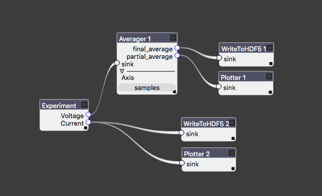

Experiment Documentation
========================

Scripting
*********

Instantiating a few *Instrument* classes as decribed in the :ref:`relevant documentation <instruments>` provides us with an environment sufficient to perform any sort of measurement. Let us revisit our simple example with a few added instruments, and also add a few software averages to our measurement.::

    pspl  = Picosecond10070A("GPIB0::24::INSTR") # Pulse generator
    mag   = AMI430("192.168.5.109")              # Magnet controller
    keith = Keithley2400("GPIB0::25::INSTR")     # Source meter

    pspl.amplitude = 0.944 # V
    mag.field      = 0.010 # T    
    time.sleep(0.1) # Stableize

    resistance_values = []
    for dur in 1e-9*np.arange(1, 11, 0.05):
        pspl.duration = dur
        pspl.trigger()
        time.sleep(0.05)
        resistance_values.append([keith.resistance for i in range(5)])

    avg_res_vals = np.mean(resistance, axis=0)

We have omitted a number of configuration commands for brevity. The above script works perfectly well if we always perform the exact same measurement, i.e. we hold the field and pulse amplitude fixed but vary its duration. This is normally an unrealistic restriction, since the experimentor more often than not will want to repeat the same fundamental measurement for any number of sweep conditions.

Defining Experiments
********************

Therefore, we recommend that users package their measurements into *Experiments*, which provide the opportunity for re-use.::

    class SwitchingExperiment(Experiment):
        # Control parameters
        field          = FloatParameter(default=0.0, unit="T")
        pulse_duration = FloatParameter(default=5.0e-9, unit="s")
        pulse_voltage  = FloatParameter(default=0.1, unit="V")

        # Output data connectors
        resistance = OutputConnector()

        # Constants
        samples = 5

        # Instruments, connections aren't made until run_sweeps called
        pspl  = Picosecond10070A("GPIB0::24::INSTR")
        mag   = AMI430("192.168.5.109")
        keith = Keithley2400("GPIB0::25::INSTR")

        def init_instruments(self):
            # Instrument initialization goes here, and is run
            # automatically by run_sweeps
            
            # Assign methods to parameters
            self.field.assign_method(self.mag.set_field)
            self.pulse_duration.assign_method(self.pspl.set_duration)
            self.pulse_voltage.assign_method(self.pspl.set_voltage)

            # Create hooks for relevant delays
            self.pulse_duration.add_post_push_hook(lambda: time.sleep(0.05))
            self.pulse_voltage.add_post_push_hook(lambda: time.sleep(0.05))
            self.field.add_post_push_hook(lambda: time.sleep(0.1))

        def init_streams(self):
            # Establish the "intrinsic" data dimensions
            # run by run_sweeps.
            ax = DataAxis("samples", range(self.samples))
            self.resistance.add_axis(ax)

        def run(self):
            # This is the inner loop, which is run for each set of
            # sweep parameters by run_sweeps. Data is pushed out
            # to the world through the output connectors.
            pspl.trigger()
            self.resistance.push(keith.resistance)

Here the control parameters, data flow, and the central measurement "kernel" have crystallized into separate entities. To run the same experiment as was performed above, we add a *sweep* to the experiment,::

    # Define a 1D sweep
    exp = SwitchingExperiment()
    exp.add_sweep(exp.pulse_duration, 1e-9*np.arange(1, 11, 0.05))
    exp.run_sweeps()

but we can at this point sweep any *Parameter* or a combination thereof: ::

    # Define a 2D sweep
    exp = SwitchingExperiment()
    exp.add_sweep(exp.field, np.arange(-0.01, 0.015, 0.005))
    exp.add_sweep(exp.pulse_voltage, np.linspace(0.1, 1.0, 20))
    exp.run_sweeps()

These sweeps can be based on *Parameter* tuples in order to accomodate non-rectilinear sweeps, and can be made adaptive by specifying convergence criteria that can modifying the sweeps on the fly. Full documentation is provided here. The time spent writing a full *Experiment* often pays dividends in terms of flexibility.

The Measurement Pipeline
************************

The central ``run`` method of an *Experiment* should not need to worry about file IO and plotting, nor should we bake common analysis routines (filtering, plotting, etc.) into the code that is only responsible for taking data. Auspex relegates these tasks to the measurement pipeline, which provides dataflow such as that in the image below.

   An example of measurement dataflow starting from the *Experiment* at left.

Each block is referred to as a *node* of the experiment graph. Data flow is assumed to be acyclic, though auspex will not save you from yourself if you attempt to circumvent this restriction. Data flow can be one-to-many, but not many-to-one. Certain nodes, such as *correlators* may take multiple inputs, but they are always wired to distinct input connectors. There are a number of advantages to representing processing and analysis as graphs, most of which stem from the ease of reconfiguration. We have even developed a specialized tool, *Quince*, that provides a graphical interfaces for modifying the contents and connectivity of the graph.

Finally, we stress data is streamed asynchronously across the graph. Each node processes data as it is received, though many types of nodes must wait until enough data has accumulated to perform their stated functions.

Connectors, Streams, and Descriptors
####################################

*OutputConnectors* are "ports" on the experiments through which all measurement data flows. As mentioned above, a single *OutputConnector* can send data to any number of subsequent filter nodes. Each such connection consists of a *DataStream*, which contains an asyncio-compatible queue for shuttling data. Since data is streamed, rather than passed as tidy arrays, all data streams are described by a *DataStreamDescriptor* that describes the dimensionality of the data. 

A *DataStreamDescriptor* contains a list of *Axes*, which contain a list of the points in the axis. These axes may be "intrinisic," as in the case of the ``DataAxis("samples", range(self.samples))`` axis added in the ``init_streams`` method above. An axis may also be a *SweepAxis*, which is added to all descriptors automatically when you add a sweep to an experiment. Thus, assuming we're using the 2D sweep from the example above, data emitted by the experiment is described by the following axes,::
    
    [DataAxis("samples", range(5)),
    SweepAxis("field", np.arange(-0.01, 0.015, 0.005)),
    SweepAxis("pulse_voltage", np.linspace(0.1, 1.0, 20))]

Importantly, there is no requirement for rectilinear sweeps, which was one of our design goals. Back on the experiment graph, each node can modify this *DataStreamDescriptor* for downstream data: e.g. an averaging node (such as that in the figure above) that is set to average over the "samples" axis will send out data described by the axes ::

    [SweepAxis("field", np.arange(-0.01, 0.015, 0.005)),
    SweepAxis("pulse_voltage", np.linspace(0.1, 1.0, 20))]

Nodes such as data writers are, of course, written such that they store all of the axis information alongside the data. To define our filter pipeline we instantiate the nodes and then we pass a list of "edges" of the graph to the experiment :: 

    exp   = SwitchingExperiment()
    write = WriteToHDF5("filename.h5")
    avg   = Averager(axis='samples')
    links = [(exp.resistance, avg.sink),
             (avg.final_average, write.sink)]
    exp.set_graph(links)

Since this is rather tedious to do manually for large sets of nodes, tools like *Quince* and *PyQLab* can be used to lessen the burden. 

Running Experiments in Jupyter Notebooks
****************************************

You should do this.

