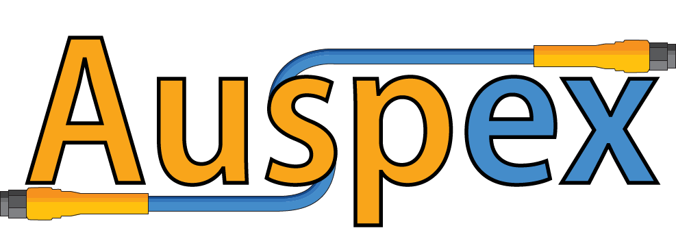

.. auspex documentation master file, created by
   sphinx-quickstart on Thu Sep 15 21:16:14 2016.
   You can adapt this file completely to your liking, but it should at least
   contain the root `toctree` directive.

.. Auspex Documentation
.. =======================

Introduction
************

Auspex, the *automated system for python-based experiments*, is a framework for performing laboratory measurements. Auspex was developed by a group that primarily performs measurements on superconducting qubits and magnetic memory elements, but its underpinnings are sufficiently general to allow for extension to arbitrary equipment and experiments. Using several layers of abstraction, we attempt to meet the following goals:

1. Instrument drivers should be easy to write.
2. Measurement code should be flexible and reusable.
3. Data acquisition and processing should be asynchronous and reconfigurable.
4. Experiments should be adaptive, not always pre-defined.
5. Experiments should be concerned with information density, and not limited by the convenience of rectilinear sweeps.

A number of inroads towards satisfying points (1) and (2) are made by utilizing metaprogramming to reduce boilerplate code in *Instrument* drivers and to provide a versatile framework for defining an *Experiment*. For (3) we make use of the python *asyncio* library to create a graph-based measurement *Filter* pipeline through which data passes to be processed, plotted, and written to file. For (4), we attempt to mitigate the sharp productivity hits associated with experimentors having to monitor and constantly tweak the parameters of an *Experiment*. This is done by creating a simple interface that allows *Sweeps* to refine themselves based on user-defined criterion functions. Finally, for (5) we build in "unstructured" sweeps that work with parameter tuples rather than "linspace" style ranges for each parameter. The combination of (4) and (5) allows us to take beautiful phase diagrams that require far fewer points than would be required in a rectilinear, non-adaptive scheme.

Installation & Requirements
***************************

Auspex can be cloned from GitHub::

	git clone https://github.com/BBN-Q/auspex.git

And subsequently installed using pip::

	cd auspex
	pip install -e .

Which will automatically fetch and install all of the requirements. If you are using an anaconda python distribution, some of the requirements can be install with *conda install*. The following, from *requirements.txt*, are required by Auspex:

- numpy >= 1.11.1
- scipy >= 0.17.1
- PyVISA >= 1.8
- h5py >= 2.6.0
- tqdm >= 4.7.0
- pandas >= 0.18.1
- networkx >= 1.11
- bokeh >= 0.12.1
- matplotlib >= 1.4.0

There are a number of other considerations depending on which experiments will be run. For the standard suite of qubit measurements on a windows machine, the following must be done:

1. Install libaps2, put the shared library on the system path and the python wrapper on the python path.
2. Build libalazar, put the shared library on the system path and the python wrapper on the python path.
3. If using PyQLab, clone a fresh directory PyQLab-auspex put it on the *feature/auspex-compat* branch for the time being. Use a fresh set of configuration .json files, which will be automatically migrated to account for auspex-specific changes. For the time being, PyQLab needs a virtual environment with Python2.7 and Qt4 for full compatibility.
4. If using Quince, pip install quince in an environment that supports Python3 and Qt5. If you are running PyQLab inside of a Python2.7/PyQt4, you must ensure that the run-quince.py script (or run-quince.bat script) is executable from the Python2.7/PyQt4 environment but invokes the proper Python3 interpreter. For anaconda on windows, one can simply copy the run-quince.bat script into the appropriate */path/to/anaconda3/envs/evn_name/scripts* directory.

Genealogy and Etymology
***********************

Auspex is a synonym for an *augur*, whose role was to interpret divine will through a variety of omens. While most researchers rightfully place their faiths in the scientific method, it is not uncommon to relate to the roles of the augur. Auspex incorporates concepts from BBN's *QLab* project as well as from the *pymeasure* project from Cornell University.

Contents:

.. toctree::
   :maxdepth: 1

   Instrument Drivers <instruments>
   Defining Experiments <experiments>
   Advanced Sweeps <sweeps>
   Integration with PyQLab/Quince <integration>
   Full API <api/auspex>

